# Taskify
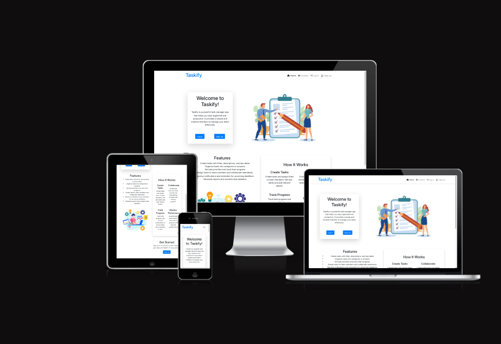

[View live website](https://taskify-ms-a3360d47713a.herokuapp.com/)

## Table of Contents
  1. [About](#about)
  2. [Project Goals](#project-goals)
  3. [User Experience](#user-experience)
      1. [Target Audience](#target-audience)
      2. [User Requirements and Expectations](#user-requirements-and-expectations)
      3. [GitHub project](https://github.com/users/sebhd1/projects/7)
      4. [Site Owner Stories](#site-owner-stories)
  4. [Technical Design](#technical-design)
     1. [CRUD Functionality](#crud-functionality)
    
  5. [Technologies Used](#technologies-used)
      1. [Coding Languages](#coding-languages)
      2. [Frameworks and Tools](#frameworks-and-tools)
      3. [Libraries](#libraries)
  6. [Front-End](#front-end)
      1. [React](#react)
  7. [Back-End API](#back-end-api)
      1. [Django REST Framework](#django-rest-framework)
  8. [Features](#features)
  9. [Future features / improvements](#future-features--improvements)
  10. [Validation](#validation)
      1. [HTML](#html-validation)
      2. [CSS](#css-validation)
      3. [ESLint JavaScript JSX Validation](#eslint-javascript-jsx-validation)
      4. [Chrome Dev Tools Lighthouse](#chrome-dev-tools-lighthouse-validation)
      5. [WAVE Validation](#wave-validation)
  11. [Testing](#testing)
      1. [Device Testing](#device-testing)
      2. [Browser Compatibility](#browser-compatibility)
      3. [Manual Testing](#manual-testing)
  12. [Bugs](#bugs)
  13. [Deployment](#deployment)
      1. [Heroku](#heroku)
      2. [Forking GitHub Repo](#forking-the-github-repository)
      3. [Clone a GitHub Repo](#clone-a-github-repository)
  14. [Credits](#credits)
      1. [Tutorial](#tutorials)
      2. [Code](#code)
  15. [Acknowledgements](#acknowledgements)

## About

Taskify web app has been developed to provide user's the chance to create and manage tasks online!.

## Project Goals

The goal for this project was to build a productivity platform in which users can create tasks where other users who feel they can help, can carry out the work as described in the task detail.
Tasks can be assigned to members and packs can also be created to group tasks together.

The key functionality aspects:

- The App to be simple and user intuitive navigation across all pages
- User authentication
- User interaction via tasks, comments and packs
- User's to have their own profiles with brief description, profile image and tab group consisting of their owned tasks, packs and other users tasks which they have been assigned
- CRUD functionality for task, comments, packs and their profile
- Tasks filtering by keyword search, new tasks and high priority tasks
- Responsiveness to allow pleasant usage of the app across a range of devices with varying display sizes

## User Experience

### Target Audience

- People who would like help with completing a task
- People who would like to keep track of outstanding tasks they may have
- People who are looking for some tasks to help others with

### User Requirements and Expectations

- A site which provides a high level of interactiveness between users
- Links and functions to act as expected
- Notification to provide feedback on expected function outcomes (user feedback )
- Simple "to the point" content that a user can easily digest
- Accessibility for impaired users
- Responsiveness to allow pleasant use across devices of different screen sizes 

## Technical Design

### CRUD Functionality

Taskify handles data with full CRUD Functionality:
 
- Create -  Users can create, an account, profile, tasks, comments, packs, contact messages and watch objects.
- Read - Users can view the tasks, comments, packs of other users and also the profiles of these users.
- Update - Users can update their profile, password, posted tasks, packs and watch status of tasks via the interactive forms and buttons on the site.
- Delete - Users can delete tasks, comments, packs and watch objects via the interactive buttons on the site.

## Technologies Used

### Coding Languages

- HTML
- CSS
- Javascript
  - React (^17.0.2)

### Frameworks and Tools

- [Axios](https://axios-http.com/docs/intro) - Axios is a Promise API. Justification: I used axios to send API requests from the React project to the API and avoid any CORS errors when sending cookies.
- [JWT](https://jwt.io/) - Library to decode JSON Web token. Justification: I used JWT to securely transmit data and to have the ability to verify that the content has not been tampered with.
- [React 17](https://17.reactjs.org/) - JavaScript library for building user interfaces. Justification: To be able to showcase my newly learnt skills and for building interactive user interfaces quickly.
- [React-Bootstrap 1.6.3](https://react-bootstrap-v4.netlify.app/) - CSS framework. Justification: I used Bootstrap React library for UI components, styling and responsiveness.
- [React Infinite Scroll](https://www.npmjs.com/package/react-infinite-scroll-component) - React library. Justification: I used this component to load content (tasks/comments/users) automatically as the user scrolls towards the bottom of the page without having to jump to next/previous page.
- [React Router](https://v5.reactrouter.com/web/guides/quick-start) - Javascript framework for routing. Justification: I used this library to enable navigation between views of components and to have the ability to control what is presented to the user based on the URL they have accessed in the browser. 
- [React Multi Select Component](https://www.npmjs.com/package/react-multi-select-component) - React Library. Justification: I used this component to have the ability to select multiple tasks to assign to a pack.

- [Am I Responsive](http://ami.responsivedesign.is/) - Website responsive test site. Justification: I used this to create the multi-device mock-up at the top of this README.md file
- [Chrome dev tools](https://developers.google.com/web/tools/chrome-devtools/) - Developer tool. Justification: I used this for debugging of the code and checking site for responsiveness
- [Cloudinary](https://cloudinary.com/) - File storage. Justification: I used this to store static files
- [Font Awesome](https://fontawesome.com/) - Icon library. Justification: I used this to style the site with icons.
- Validation:
  - [WC3 Validator](https://validator.w3.org/) - HTML Validator. Justification: I used this to validate the applications HTML code
  - [Jigsaw W3 Validator](https://jigsaw.w3.org/css-validator/) - CSS Validator. Justification: I used this to validate the applications CSS code
  - [ESLint](https://eslint.org/) - JavaScript Validator. Justification: I used this to validate applications JSX code
  - [Lighthouse](https://developers.google.com/web/tools/lighthouse/) Site auditing tool. Justification: I used this to validate performance, accessibility, best practice and SEO of the application
  - [Wave](https://wave.webaim.org/) - Site accesibility auditor. Justification: I used this to evaluate the applications accessibility

### Libraries

#### Installed Libraries

| Package                         | Version |
|---------------------------------|---------|
| axios                           | 1.3.4   |
| bootstrap                       | 4.6.0   |
| jwt-decode                      | 3.1.2   |
| react-bootstrap                 | 1.6.3   |
| react-dom                       | 17.0.2  |
| react-infinite-scroll-component | 6.1.0   |
| react-multi-select-component    | 4.3.4   |
| react-router-dom                | 5.3.0   |
| react-scripts                   | 5.0.1   |
| react-scroll                    | 1.8.9   |
| web-vitals                      | 2.1.4   |

## Front-End

There were various pages created and used in this application

- auth - The auth page group consisted of the following files:
	- LoginForm.js - This file handles the Login form
	- SignUpForm.js - This file handles the Sign-up form

- comments - The comments page group consisted of the following files:
	- Comment.js - This file returns the comments
	- CommentEditForm.js - This file handles the Comment Edit form
	- CommentForm.js - This file handles the create comment form

- contact - The contact page group consisted of the following files:
	- ContactForm.js - This file handles the contact form

- dashboard - The dashboard page group consisted of the following file:
	- Dashboard.js - This file returns the auth users main page (dashboard)

- landing - The landing page group consisted of the following file:
	- Landing.js - This file returns the main page to an anonymous user

- packs - The packs page group consisted of the following files:
	- Pack.js - This file returns the Pack and all its related info
	- PackCreateForm.js - This file handles the Pack create form 
	- PackDetail.js - This file returns the pack detail
	- PackEditForm.js - This file handles the Pack edit form
	- PackListings.js - This file returns the list of packs

- profiles - The profiles page group consisted of the following files:
	- EditPasswordForm.js - This file handles the Edit Password form
	- EditProfileForm.js - This file handles the edit profile form
	- Profile.js - This file returns the profile section
	- ProfilePage.js - This file returns the entire Profile page
	- UserProfiles.js - This file returns all users of the site

- tasks - The tasks page group consisted of the following files:
	- Task.js - This file returns the Task and all its related info
	- TaskCreateForm.js - This file handles the Task create form 
	- TaskDetail.js - This file returns the task detail
	- TaskEditForm.js - This file handles the Task edit form
	- TasksListings.js - This file returns the list of Tasks

## Back-End API

### Django REST Framework

The API for this Front-End application was built with the Django REST Framework. The repository with a README file for the DRF Back-End can be found [here](https://github.com/sebhd1/taskifyApi).

## Features

## Future features / improvements

Although a lot of effort was put into this project, due to time constraints there is still room for finer refactoring of code and additional functionality / features to implement to the site. 

- Password recovery
  - Forgotten password option to recover access to the account using a one time link via email
- Account creation via socials
  - Allow user authentication with already existing accounts, e.g. Github, Google, etc. 
- A notifications feature (email)
  - A feature to have notifications related to tasks you are involved in / own and if their completion status has been updated.

## Validation 

### HTML Validation

The W3C Markup Validation Service was used to validate the HTML of the website. No errors were identified. 

### ESLint JavaScript JSX Validation 

All JavaScript files were validated using ESLint JavaScript validator. All files passed however there were some rules that needed to be set in the eslintrc.js file as described below:

`"rules": {
        "react/prop-types": 0,
        "react/no-children-prop": "off",
        "react/display-name": "off"
    }`

  - `"react/prop-types": 0` was used to suppress the errors relating to prop-types
  - `"react/no-children-prop": "off"` was used to suppress the errors related to the Infinit Scroll component using children={} 
  - `"react/display-name": "off"` was used to suppress the need for a component display name 

### Wave Validation

The WAVE WebAIM web accessibility evaluation tool was used to test the websites' accessibility.

Results
 

Main page (not logged in)
 
 

Main page (logged in user)
 
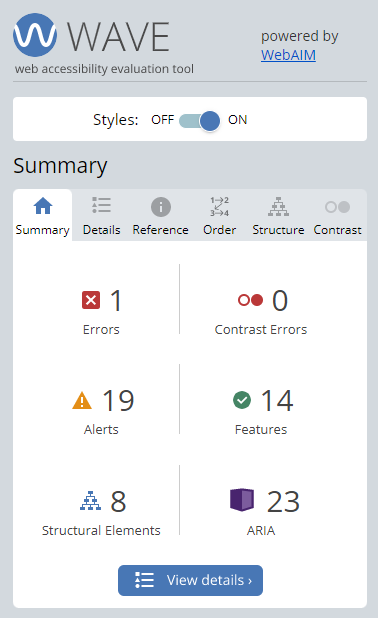 

 

Signup page
 
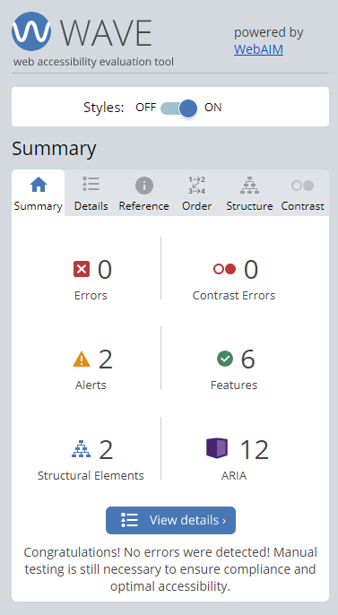 

Login page
 
 

Tasks page

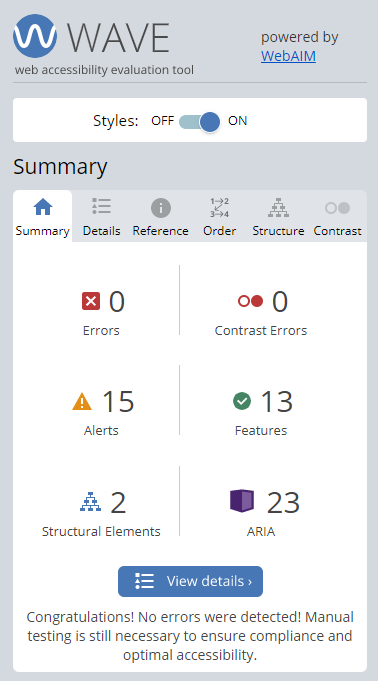

Task create page

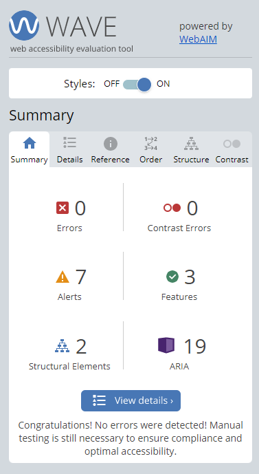

Task edit page

Task detail page

Watched page

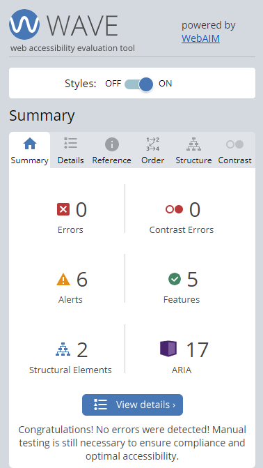

Pack page

Pack create page

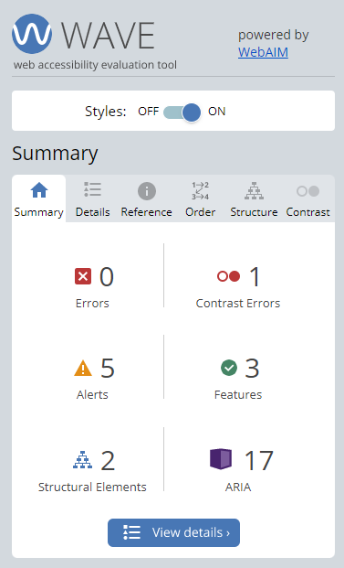

Pack edit page

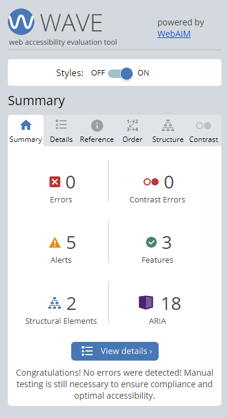

Pack detail page

Contact page

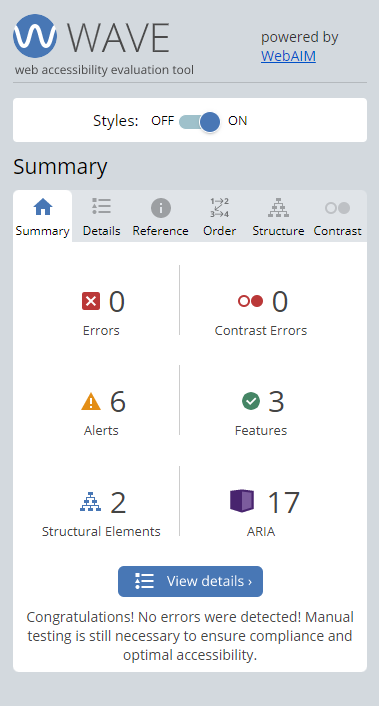

Users page

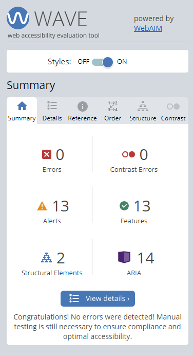

Profile page

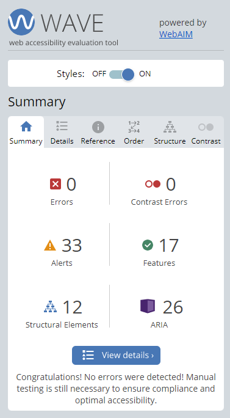

Profile edit page

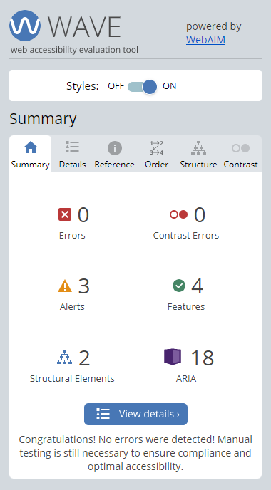

Change password page

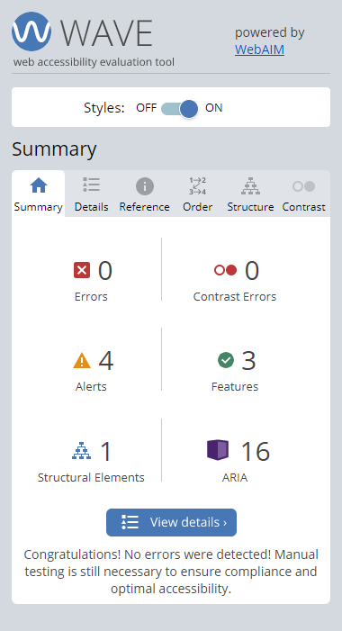

404 page

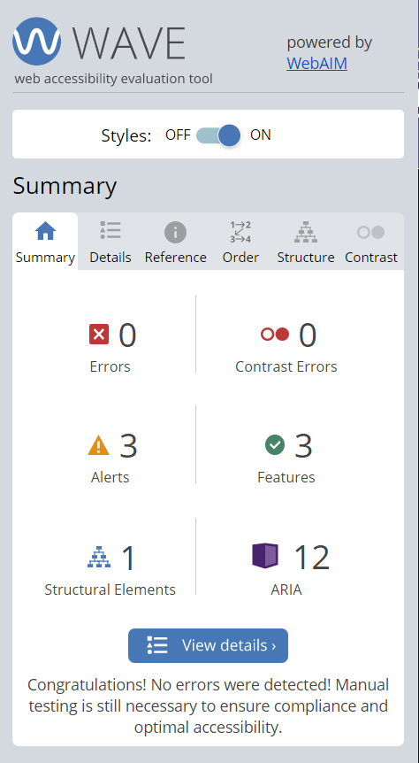

## Testing
 
### Manual testing

Tests were performed mostly manual and throughout the development phase and deployment.

#### Testing User Stories - Users

1. As a new user, I can register an account with Taskify so that I can become a member and use the app as intended.

| Feature       | Action        | Expected Result  | Actual Result |
| ------------- | ------------- | -------------    | ------------- |
|  Authentication  | Navigate to the sign up page, fill in the required fields and submit the sign up form  | An account which requires authentication will be created upon a successful account creation  | Works as expected |
|  Sign Up  |  Navigate to the sign up page, fill in the required fields and submit the sign up form |  User to navigate to the sign up page, enter all required fields and upon account creation be redirected to the log in page | Works as expected |
|  Input Validation  | Enter values into the sign up form fields  | Fields requiring input will be validated and make the user aware if any validation errors occur  | Works as expected |

2. As a user, I can use the navigation bar so that I can seamlessly navigate around the app.

| Feature       | Action        | Expected Result  | Actual Result |
| ------------- | ------------- | -------------    | ------------- |
|  Nav Bar  | Locate the nav bar located at the top of each page and select the relevant link, if on smaller devices click on the burger dropdown button to access the same icons / links  | User to be able to find the nav bar located at the top of each page and use to navigate their way through the site  | Works as expected |

3. As a user, I can see visual indicators for example of having watched / unwatched a task so that I can tell what my status of watching is.

| Feature       | Action        | Expected Result  | Actual Result |
| ------------- | ------------- | -------------    | ------------- |
|  Watched / Unwatched button  | Navigate to the task list page or a page detail page, the Watch / Unwatch status button will be located in the bottom right corner indicating if the task is watched or not by the current user  | Watch icon to update dependant on the status of if a currently signed in user has a watch relationship with the task object  | Works as expected |

4. As a user, I can watch and unwatch tasks so that I can keep up to date with that particular task via a filtered list. 

| Feature       | Action        | Expected Result  | Actual Result |
| ------------- | ------------- | -------------    | ------------- |
|  Watch / Unwatch task  | Navigate to the task list page or a page detail page, the Watch / Unwatch status button will be located in the bottom right corner indicating if the task is watched or not by the current user  | Watch icon to update dependant on the status of if a currently signed in user has a watch relationship with the task object  | Works as expected |
|  Watched / Unwatched button  | Navigate to the task list page or a page detail page, the Watch / Unwatch status button will be located in the bottom right, click on the icon to watch / unwatch a task  | Watch icon to update dependant on the status of if a currently signed in user has a watch relationship with the task object  |Works as expected  |

5. As a user, I can view a list of my watched tasks so that I can focus on content I wish to view. 

| Feature       | Action        | Expected Result  | Actual Result |
| ------------- | ------------- | -------------    | ------------- |
|  Watched list  | Navigate to the watched list page via the link in the nav bar. View the list of currently watched tasks.  | User to be presented with the list of all their currently watched task   | Works as expected |

6. As a user, I can use the search bar on the Task list section so that I can find particular tasks easier. 

| Feature       | Action        | Expected Result  | Actual Result |
| ------------- | ------------- | -------------    | ------------- |
| Search Bar   | Navigate to the task lists page via the icon / link in the nav bar. At the top of the page find the search bar, enter desired characters / keywords and be shown the results.   | Users to be presented with a list of relevant tasks based on their search query and if there is no results a no results found image will display. | Works as expected |

7. As a user, I can delete my tasks so that I can permanently remove tasks I do not wish to keep. 

| Feature       | Action        | Expected Result  | Actual Result |
| ------------- | ------------- | -------------    | ------------- |
|  Delete Task  | Navigate to the task in questions task detail page, click on the 3 dots icon located in top right corner and click on the delete button to delete the task  | User to click the delete button and the task to be deleted from the database  | Works as expected |

8. As a user, I can edit my tasks so that I can correct spelling mistakes I may have entered into the task information fields.

| Feature       | Action        | Expected Result  | Actual Result |
| ------------- | ------------- | -------------    | ------------- |
|  Edit Task  | Navigate to the task in questions task detail page, click on the 3 dots icon located in top right corner and click on the edit button to be taken to the edit task form. Enter relevant values into fields and click on save or cancel to cancel the current edit  | User to click the edit button and the task edit form to be displayed in which the user can update the tasks information  | Works as expected |

9. As a user, I can view task comments so that I can obtain more information on the task in question. 

| Feature       | Action        | Expected Result  | Actual Result |
| ------------- | ------------- | -------------    | ------------- |
|  Task Comment  | Navigate to a task by means of the tasks list or a users profile task list. Click on a task to view the task detail page. Scroll to bottom and the comment section for that particular task will be displayed  | User to be able to view their own and other users comments on the currently displayed task.  | Works as expected |

10. As a user, I can comment on other tasks so that I can interact with other users.

| Feature       | Action        | Expected Result  | Actual Result |
| ------------- | ------------- | -------------    | ------------- |
|  Create task comment  | Navigate to a task by means of the tasks list or a users profile task list. Click on a task to view the task detail page. Scroll to bottom and the comment section for that particular task will be displayed . Enter comment into the comment box and click post to add the comment | User to be able to post a comment that will show their name, profile image and how long ago the comment was posted  | Works as expected |

11. As a user, I can edit or delete my comment on a task incase of input error. 

| Feature       | Action        | Expected Result  | Actual Result |
| ------------- | ------------- | -------------    | ------------- |
|  Edit task comment  | Navigate to a task by means of the tasks list or a users profile task list. Click on a task to view the task detail page. Scroll to bottom and the comment section for that particular task will be displayed . Find the comment you wish to edit and click on the three dots icon. Enter updated comment and click save  | User to be able to edit and update their owned comments  | Works as expected |
|  Delete task comment  |  Navigate to a task by means of the tasks list or a users profile task list. Click on a task to view the task detail page. Scroll to bottom and the comment section for that particular task will be displayed . Find the comment you wish to delete and click on the three dots icon. Click on the delete button to delete the comment | User to be able to edit and update their owned comments  | Works as expected |

12. As a user, I can manage my tasks so that I can add, edit or delete tasks as needed. 

| Feature       | Action        | Expected Result  | Actual Result |
| ------------- | ------------- | -------------    | ------------- |
|  Create task  | Click on the Create task button which is located at the top of the task list page or from your own profile. Fill in the form with the relevant information into the form fields and click save.  | User to be able to successfully create a task which will be added to the database and all relevant pages on the site  | Works as expected |
|  Delete task  | Navigate to the task detail page by clicking on the relevant task on the task list, or from a users profile. Click on the 3 dots icon in the top right corner of the task. Click on the delete button  | User to click the delete button and the task to be deleted from the database  | Works as expected |
|  Edit task  | Navigate to the task in questions task detail page, click on the 3 dots icon located in top right corner and click on the edit button to be taken to the edit task form. Enter relevant values into fields and click on save or cancel to cancel the current edit  | User to click the edit button and the task edit form to be displayed in which the user can update the tasks information  | Works as expected |

13. As a user, I can request a password so that I can log back into my account if I have forgotten my password. 

| Feature       | Action        | Expected Result  | Actual Result |
| ------------- | ------------- | -------------    | ------------- |
|  Change Password  | From any page, click on the Contact icon in the Nav Bar. Fill out the form stating a password has been forgotten and submit the form  | User will be giving a feedback message on successful contact message post and the admin will reset the password from the back end | Works as expected |

14. As a user, I can log in so that I can access my account, view my profile, tasks and other user's tasks. 

| Feature       | Action        | Expected Result  | Actual Result |
| ------------- | ------------- | -------------    | ------------- |
|  Authentication  | Navigate to the log in page, fill in the required fields and submit form to login  | User log in credentials to be authenticated against the database and granted access if valid  | Works as expected |
|  Log in  | Navigate to the log in page, fill in the required fields and submit form to login  | User log in credentials to be authenticated against the database and granted access if valid  | Works as expected  |
|  Input validation  | From the log in page enter information to the username and password fields  |  User to be informed if entered values to not meet validation criteria | Works as expected |

15. As a user, I can log out so that other users using the same device cannot access my account. 

| Feature       | Action        | Expected Result  | Actual Result |
| ------------- | ------------- | -------------    | ------------- |
|  Log out  | From the nav bar click on the log out icon  | User to be successfully logged out and return to the home page  | Works as expected |

16. As a user, I can have a profile page so that I and other users can view my list of tasks, packs and assigned tasks.

| Feature       | Action        | Expected Result  | Actual Result |
| ------------- | ------------- | -------------    | ------------- |
|  Profile section  | Sign up to the site and then navigate to the profile page from the nav bar  | User to be presented with their profile page which displays all relevant information of the user  | Works as expected |
|  Profile tabs  | Navigate to the profile page. Using the tabs click on each one to display the desired information such as tasks, packs and assigned items.  | User to be able to view all information related to their profile and prescence on the site.  | Works as expected |

17. As a user, I can update my profile so that my profile can stay up to date with my latest information. 

| Feature       | Action        | Expected Result  | Actual Result |
| ------------- | ------------- | -------------    | ------------- |
|  Edit Profile  | Navigate to the users profile by clicking on the profile icon on the nav bar. Click on the 3 dots icon in the top right corner. Click on edit profile button. Enter new values for fields and click submit  | Users profile to be updated with values entered to form fields.  | Works as expected |
|  Task count  | Navigate to the users profile by clicking on the profile icon on the nav bar. View the task count located in the middle of the profile information panel  | Users to be provided with the currently viewed profiles task count  | Works as expected |
|  Change Password  | Navigate to the profile page by clicking on the profile button on the nav bar or the icon of posted by avatar on a task. Click the 3 dots icon in the top right corner of the profile. Click on edit profile, from the edit profile form click on the change password button. Enter new password and confirm password then submit.  | User should be able to update their password and be presented with a modal to confirm on successfull update | Works as expected |

18. As a user, I can add a profile picture so that other members can easily recognize my tasks or comments.

| Feature       | Action        | Expected Result  | Actual Result |
| ------------- | ------------- | -------------    | ------------- |
| Edit profile   | Navigate to the users profile by clicking on the profile icon on the nav bar. Click on the 3 dots icon in the top right corner. Click on edit profile button. add image by clickon on the chose file button. Once image has been selected click save button  | User to have the ability to update their profile image to whatever they select from their drive  | Works as expected |

19. As a user, I can view the Home Page so that I can understand what the website is about, create an account or log in. 

| Feature       | Action                                                                        | Expected Result  | Actual Result |
| ------------- |-------------------------------------------------------------------------------| -------------    | ------------- |
|  Home page  | Navigate to the Taskify site in your internet browser. View the landing page. | User to view the landing page and be able to understand what the website is about  | Works as expected |

20. As a user, I can display basic info on my profile page so that other members can learn more about me. 

| Feature       | Action        | Expected Result  | Actual Result |
| ------------- | ------------- | -------------    | ------------- |
| Profile section   | Navigate to the users profile by clicking on the users icon from the nav bar and then searching for the user from the user list clicking on the desired profile to view  | Users profile to be updated with values entered to form fields.  |Works as expected  |

21. As a user, I can search for tasks via a task list or search bar so that I can find specific tasks.

| Feature       | Action        | Expected Result  | Actual Result |
| ------------- | ------------- | -------------    | ------------- |
| Task list   | When logged in, navigate to the task lists page from the nav bar. Scroll down the page to view all tasks that are on that database  | User to be presented with list of all tasks  | Works as expected |
| Task search   | When logged in, navigate to the task lists page from the nav bar. Use the search bar at the top of the page to search for tasks based on words, letter or numbers  | User to be able to query the database for specific tasks based on their search criteria  | Works as expected |

22. As a user, I can fill in a contact form so that I can enquire about issues I may have regarding the app. 

| Feature       | Action        | Expected Result  | Actual Result |
| ------------- | ------------- | -------------    | ------------- |
|  Contact  | Click on the Contact icon from the nav bar which is available to annonymous and authenticated users. Enter the relevant information to the form fields and click on submit  | Users and visitors to the site to have the ability to post a contact query and be presented with feedback on successful posting of query  | Works as expected |

23. As a user, I can receive feedback so that I can confirm whether the contact form submission was successful or not.

| Feature       | Action        | Expected Result  | Actual Result |
| ------------- | ------------- | -------------    | ------------- |
|  Site feedback  | Perform various tasks for example a form to be sent which would require some form of feedback  | User to be provided feedback regarding the sucess status of the performed task  | Works as expected |

24. As a user, I can scroll through the latest tasks on the app so that I can find new tasks to complete.

| Feature       | Action        | Expected Result  | Actual Result |
| ------------- | ------------- | -------------    | ------------- |
|  Task list  | Log in and navigate to the task list page by clicking on the task list icon in the nav bar. Scroll the list of tasks.  | Users to be able to scroll through all tasks that are on the database  | Works as expected |

25. As a user, I can browse a list of user accounts so that I can view that particular account. 

| Feature       | Action        | Expected Result  | Actual Result |
| ------------- | ------------- | -------------    | ------------- |
|  Users list  | Log in and from the nav bar click on the users icon. View the list of all users on the platform  | Users to be able to view a list of all users on the platform and also use the search bar to help aid finding users  | Works as expected |

26. As a user, I can create tasks so that I can partake in the main purpose of the site.

| Feature       | Action        | Expected Result  | Actual Result |
| ------------- | ------------- | -------------    | ------------- |
|  Create Task  | From the Nav bar click on the add task button or from the Tasks page, Watched page or profile page click on the create task button  | User to be presented with a form to create a task and upon submission create a task object | Works as expected |

27. As a user, I can create packs so that I can group tasks together.

| Feature       | Action        | Expected Result  | Actual Result |
| ------------- | ------------- | -------------    | ------------- |
|  Create Pack  | From packs page or profile page click on the create pack button  | User to be presented with a form to create a pack and upon submission create a pack object | Works as expected |

28. As a user, I can delete my packs so that I can permanently remove packs I do not wish to keep.

| Feature       | Action        | Expected Result  | Actual Result |
| ------------- | ------------- | -------------    | ------------- |
|  Delete pack  | Navigate to the pack detail page by clicking on the relevant pack on the pack list, or from a users profile. Click on the 3 dots icon in the top right corner of the pack. Click on the delete button  | User to click the delete button and the pack to be deleted from the database  | Works as expected |

29. As a user, I can edit my packs so that I can correct spelling mistakes or I may have entered into the pack information fields.

| Feature       | Action        | Expected Result  | Actual Result |
| ------------- | ------------- | -------------    | ------------- |
|  Edit pack  | Navigate to the pack in questions pack detail page, click on the 3 dots icon located in top right corner and click on the edit button to be taken to the edit task form. Enter relevant values into fields and click on save or cancel to cancel the current edit  | User to click the edit button and the pack edit form to be displayed in which the user can update the packs information  | Works as expected |

#### Testing User Stories - Site Owner

30. As the site owner, I would want to validate users' data entries on sign up so that users can create a log in which meets the requirements.

| Feature       | Action        | Expected Result  | Actual Result |
| ------------- | ------------- | -------------    | ------------- |
| Input validation   | Navigate to the Taskify site. Click on the log in icon in the nav bar. Enter username and password to the relevant fields.   | User input to be validated again the database and signed in if valid and presented with error messages relevant to the validation failing  | Works as expected |

31. As the site owner, I would want to ensure only logged in users can post from their account and edit their profile so that data privacy is ensured. 

| Feature       | Action        | Expected Result  | Actual Result |
| ------------- | ------------- | -------------    | ------------- |
| Authentication   | Create code which authenticates if the current user is the owner of items within the site prior to allowing them to edit or delete such items  | Users can only edit or delete tasks and packs they own or their own profile and not others  | Works as expected |

32. As the site owner, I would want to have the ability to remove tasks and task comments so that I can keep the app clean and friendly. 

| Feature       | Action        | Expected Result  | Actual Result |
| ------------- | ------------- | -------------    | ------------- |
|  Delete task  | Access the task objects in the back end API with Djangos admin panel and delete the neccessary tasks  | Admin to have the ability to delete any database task  | Works as expected |
|  Delete task comment  |  Access the comment objects in the back end API with Djangos admin panel and delete the neccessary comments | Admin to have the ability to delete any database comment  | Works as expected |

33. As the site owner, I would want the site to be fully responsive so that users can use it across multiple devices and create a good user experience.

| Feature       | Action        | Expected Result  | Actual Result |
| ------------- | ------------- | -------------    | ------------- |
|  Responsiveness  | Use the site on a range of devices and screen sizes  | Users will have a pleasant and enjoyable experience on the website regardless of their screen or device size  | Works as expected |

34. As the site owner, I would want to use the app search function so that I can search for particular tasks by their title.

| Feature       | Action        | Expected Result  | Actual Result |
| ------------- | ------------- | -------------    | ------------- |
|  Task search  |When logged in, navigate to the task lists page from the nav bar. Use the search bar at the top of the page to search for tasks based on words, letter or numbers  | User to be able to query the database for specific tasks based on their search criteria | Works as expected |

35. As the site owner, I would want a 404 error page so that users do not have to use the back navigation button if an error occurs.

| Feature       | Action        | Expected Result  | Actual Result |
| ------------- | ------------- | -------------    | ------------- |
|  Error pages  | Navigate to any page that does not exist  | User to be presented with 404 error page and a button to return home  | Works as expected |

## Bugs

| **Bug** | **Fix** |
| ------- | ------- |
| Pack not submitting the tasks array to the database | Although the database has been created in such way to accept a list of tasks, it didn't seem to work when passing a list of task id's in the form. Tests were conducted which proved that a single entry could be entered, i decided to try and create a for loop to pass in each task to the pack one a time and this achieved the desired outcome |
| Task edit form wont submit if due_date is not set a value | Update due_date to be an empty string and a conditional if statement was placed in the form append which checked if due_date was left empty or null and if true it wouldn't append this field. This fixed the issue as the field in the database has blank and null set to True |
| Profile list only displaying the first 10 results in Infinite Scroll | fetchMoreData was properly implemented  |
| assigned to tasks wouldn't display in the assigned to tab | A filter was added that would filter tasks based on if the assigned_to id matched that of the profile owners |
| Tab active colour would revert to the default | Documentation for react bootstrap didn't mention that the CSS has to be over written by using activeClassName property. Once this was used the issue was resolved |
| Searching for tasks if the single letter Y is entered, tasks with a title that only includes a number will be displayed | I could not work out why this was the case therefore this has had to be left in as a known bug |
| When editing a pack, the data is not correctly pulled from the database thus resulting in the user having to remove all tasks and re select them | Due to time constraints i was unable to find a solution to this bug so i had to be left as a know bug. This bug still allows functionality although the user experience is slightly impacted due to this |
| Pack details not displaying list of associated tasks due to 500 error | Due to not having control over the status of elephant SQLs servers I had to leave this as a known bug. I did implement code to retry if a 500 error is returned however sometimes this exceeds the max retry of 3 times. This bug still allows functionality although the user experience is slightly impacted due to having to refresh the page manually in the occasional instances in which this happens |

## Deployment

### Heroku

This project was deployed to [Heroku](https://www.heroku.com) in the project's early stages to allow continual responsive testing. This was achieved via the following steps:

The website was deployed with Heroku by following these steps:

1. Use the "pip freeze -> requirements.txt" command in the terminal to save any libraries that need to be installed in the file.
2. The app uses Cloudinary to host the post images therefore a Cloudinary account will be required. 
3. Log in to [Cloudinary](https://cloudinary.com/) or create an account for free.
4. Navigate to the Dashboard on Cloudinary

Screenshot

5. Copy and store the value of the 'API Environment Variable' beginning at cloudinary:// until the end, this will be used in the Heroku Config Vars. 
6. The app also uses ElephantSQL to host the database
7. Log in to [ElephantSQL](https://www.elephantsql.com/) or create an account for free.
8. Click on Create a new instance

Screenshot

9. Set up your plan. Give the 'plan' the desired name, select the Tiny Turtle (free) plan and leave tags blank.

Screenshot

10. Select the region and choose the nearest data centre to your location.

Screenshot

11. Click 'review' and if happy with the details presented click on the create instance button.

Screenshot

12. From the instances section click on the instance with the name that was just created.
13. Get the ElephantSQL database URL from the instance details page and copy, this will be used in the Heroku Config Vars

Screenshot

14. Navigate to https://www.heroku.com/ and login or create an account. 
15. Click the "new" button in the upper right corner and select "create new app".

Screenshot

16. Choose an app name and your region and click "Create app".

Screenshot

17. Reveal Config Vars and store the required config var names and values as below:

- `CLOUDINARY_URL`: *your Cloudinary URL as obtained above*
- `DATABASE_URL`: *your ElephantSQL postgres database URL as obtained above*
- `PORT`: `8000`
- `SECRET_KEY`: *your secret key*

Screenshot

18. Go to the "deploy" tab and pick GitHub as a deployment method.
19. Search for a repository to connect to and select the branch you would like to build the app from.
20. If preferred, enable automatic deploys and then deploy branch.
21. Wait for the app to build and then click on the "View" link which will redirect you to the deployed link.

### Forking the GitHub Repository

We can make a copy of the original repository on our GitHub account to view or make changes too without affecting the original repository, this is known as forking. Forking in GitHub can be done via the following steps:

1. Navigate to www.github.com and log in.
2. Once logged in navigate to the desired [GitHub Repository](https://taskify-ms-a3360d47713a.herokuapp.com/) that you would like to fork.
3. In the top right corner of the page click on the fork icon.
4. There should now be a copy of your original repository in your GitHub account.

Please note if you are not a member of an organization on GitHub then you will not be able to fork your own repository.
   
### Clone a GitHub Repository

You can make a local clone of a repository via the following steps: 

1. Navigate to www.github.com and log in.
2. Once logged in navigate to the desired [GitHub Repository](https://taskify-ms-a3360d47713a.herokuapp.com/) that you would like to clone.
3. Locate the code button at the top, above the repository file structure.
4. Select the preferred clone method from HTTPS. SSH or GitHub CLI then click the copy button to copy the URL to your clipboard.
5. Open Git Bash
6. Update the current working direction to the location in which you would like the clone directory to be created.
7. Type `git clone` and paste the previously copied URL at Step 4.
8. `$ clone https://taskify-ms-a3360d47713a.herokuapp.com/`
9. Now press enter and the local clone will be created at the desired local location

## Credits

### Tutorials

- Real Python Django redirects tutorial - [The Ultimate Guide to Django Redirects](https://realpython.com/django-redirects/)
- React-multi-select-component video by [Monsterlessons Academy](https://www.youtube.com/@MonsterlessonsAcademy) - [React Select Example | React Dropdown Menu - Fully Customizable](https://www.youtube.com/watch?v=3u_ulMvTYZI)

### Content

- I used fonts from [Google Fonts](https://fonts.google.com/) for this project.

- I used Stack Overflow for general troubleshooting and issues with grid spacing.

- Feedback and comments from the reviewer of my previous portfolio projects were taken into account for this project when running tests and identifying and fixing bugs.

* The static images were taken from [Unsplash](https://unsplash.com/)

### Information Sources / Resources

* [W3Schools - Python](https://www.w3schools.com/python/)
* [Stack Overflow](https://stackoverflow.com/)
* [Scrimba - Pyhton](https://scrimba.com/learn/python)

### Code

 Code from external sources were used as a basis and built on top of in this project, they are credited below:

 - The basis of this project was inspired by the 'Moments' social media platform walk-through project with Code Institute. Using this a basis for user log in, profile creation and posting to the API I have built my own app and added extra functionality, such as creating task packs and assigning tasks to users.

## Acknowledgements
This application was executed and completed as a portfolio 5 Project for the full stack diploma at Code Institute.

Sebastiano Ballotta, 2023.
